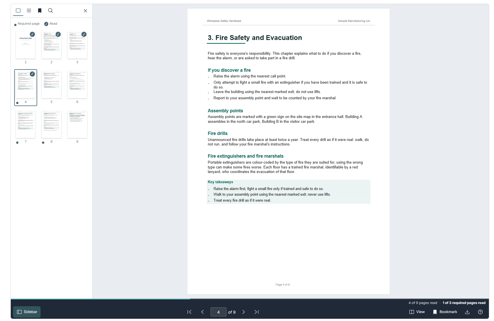
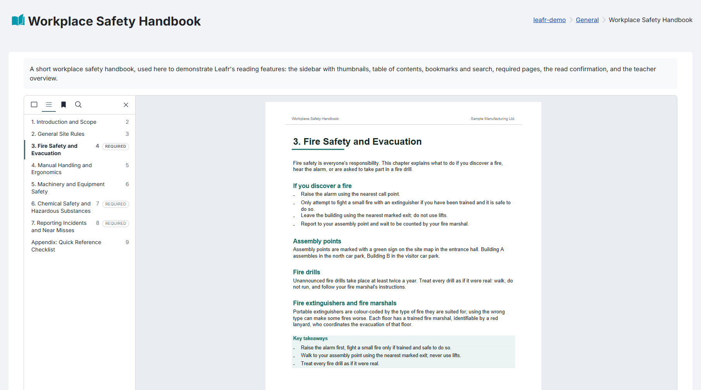
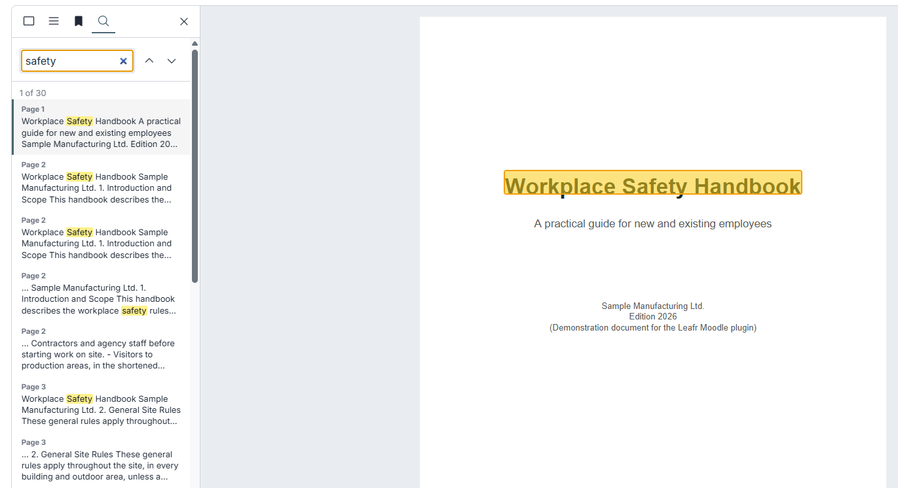
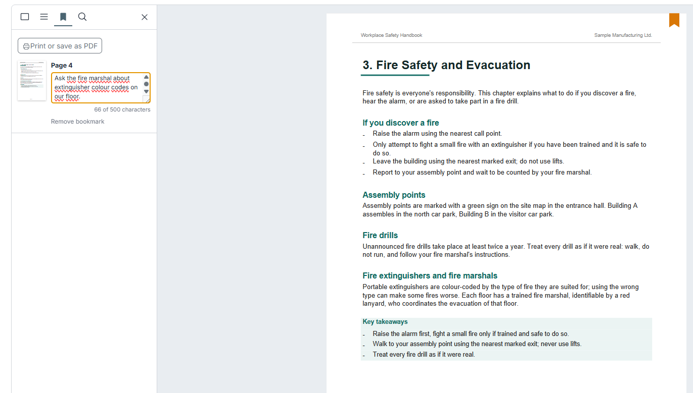
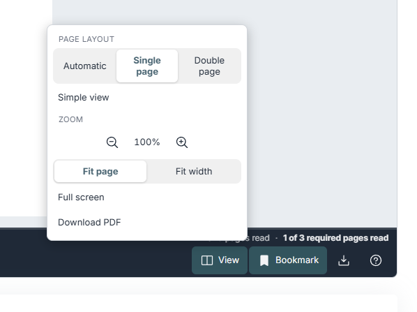
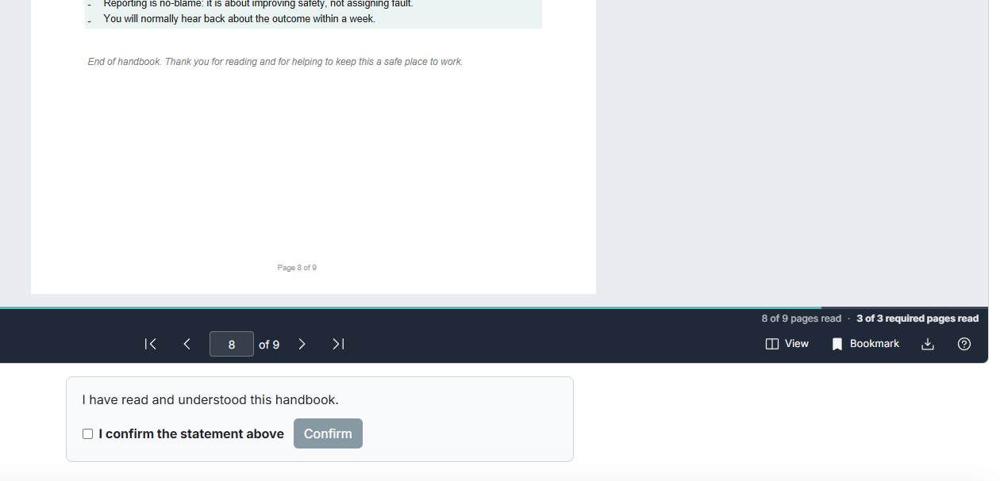
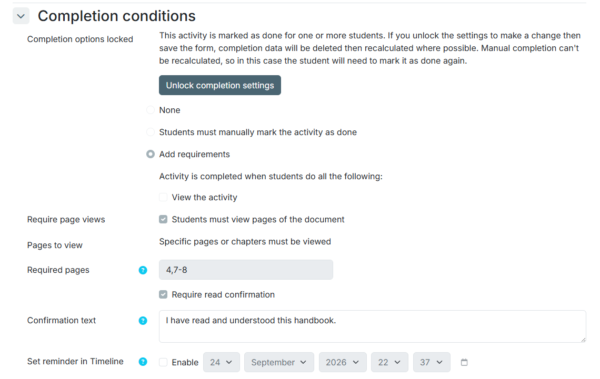
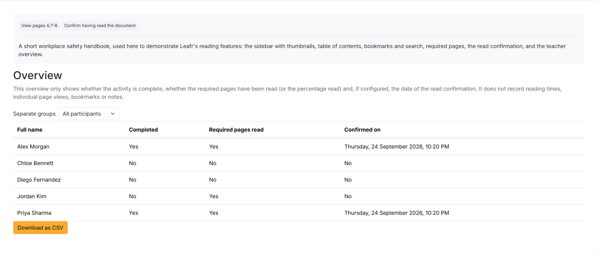

# Leafr flipbook (mod_leafr)

Leafr is a Moodle activity that turns a PDF document into a book students can leaf through, directly inside the course — no external service, no extra login. The PDF stays in Moodle, is rendered in the browser, and every reading action (page turned, bookmark set, document read) is tracked the same way as any other Moodle activity.

## What Leafr is for

Moodle already lets you attach a PDF as a plain file. Leafr is for the cases where that is not enough:

- **A book, not a scroll**: real page-turning, chapters, a table of contents and bookmarks with your own notes — read a long document the way you'd read a book, not the way you scroll a file. Bookmarks and notes can be exported as a PDF.
- **Proof of reading, not just a tick-box**: mark certain pages or chapters as required, and ask for an active read confirmation with a timestamp — for material people actually have to read, like safety briefings and policies.
- **Everything included, nothing held back**: thumbnails, full-text search, notated bookmarks, a teacher overview report, read confirmation — all part of the one free plugin, no paid tier.
- **Accessible from the ground up**: a simple, scrollable view that's fully accessible to screen readers sits alongside the book view as an equal alternative.
- **Privacy by design**: no external service, no analytics tool, full support for Moodle's Privacy API, and deliberately no tracking of reading times or how long someone lingered on a page.
- **Built for teaching, not just IT**: an overview report per participant, flexible completion rules, manual chapters for PDFs without an outline, and an interface available in German, English and Spanish.

If none of that applies and a plain file or a "Resource" activity is enough for your PDF, you don't need Leafr — and that's a fine outcome.

## Why a book, not a scroll

The page-turning book view exists because for longer structured documents (handbooks, manuals, multi-chapter guides), page-by-page navigation with a visible table of contents mirrors how people already read printed material, and it gives you a natural, countable unit ("page 12 of 40") to hang completion tracking on. It is not required, though: a **simple view** (all pages below each other, scrollable, fully accessible to screen readers) is available at any time and is used automatically when the browser requests reduced motion.

## Screenshots

| | |
|---|---|
|  |  |
| Sidebar: page thumbnails, with a checkmark for pages already read and a dot for required pages | Sidebar: table of contents, automatic from the PDF or defined by the teacher, required chapters marked |
|  |  |
| Sidebar: full-text search with highlighted matches | Sidebar: bookmarks with a personal note |
|  |  |
| View menu: page layout, simple view, zoom, full screen | Read confirmation, shown once the required pages have been read |
|  |  |
| Activity settings: required pages/chapters combined with the read confirmation | Overview report for teachers, with group filter and CSV export |

## Features

For students:

- **Book view** with a realistic page-turning animation: two-page spread on large screens, single pages on phones and for landscape documents, or a fixed layout chosen in the view menu (remembered per user).
- **Simple view** without animation: all pages below each other, scrollable, with the text of each page available to screen readers. It is used automatically when the operating system asks for reduced motion and can be switched on at any time.
- **Continue reading**: the document opens at the page read last.
- **Sidebar** with page thumbnails, contents (the PDF outline or chapters defined by the teacher), bookmarks and full-text search with highlighted matches.
- **Bookmarks with notes**: bookmark any page and add a personal note (up to 500 characters, saved automatically); print the list or save it as PDF.
- **Zoom** (50 % to 300 %), fit to page or width, **full screen**, page number input and progress bar.
- **Keyboard shortcuts** once the document has the focus: arrow keys, Page Up/Down, Home/End, `+`/`-`, `T` (contents), `B` (bookmark), `F` (full screen), `?` (help).
- Works on phones and tablets: swipe to turn pages, the toolbar adapts to the available width.

For teachers:

- **Completion** when the last page, a percentage of the pages, a specific page, or specific pages and chapters (e.g. "1-5, 8, 12-20") have been viewed. Required pages are marked for students.
- **Read confirmation** (optional completion rule): students confirm a statement of your choice after reading.
- **Overview report**: per participant only completion, required pages read and the confirmation date, with group filter (respecting separate groups) and CSV export. Reading times and individual page views are deliberately not shown.
- **Manual chapters** for PDFs without an outline, or instead of the PDF's own outline.
- Optional **download** of the original PDF (per activity setting and capability `mod/leafr:download`).
- Backup and restore, duplication, course reset, Privacy API (GDPR), events for page views.

## Requirements

- Moodle 4.5 to 5.2 (tested with 4.5, 5.0, 5.1 and 5.2)
- PHP 8.1 or later

## Installation

1. Download the ZIP file or clone this repository into the folder `mod/leafr` of your Moodle installation.
2. Log in as administrator and follow the upgrade notification, or run `php admin/cli/upgrade.php`.

## Usage

Add the activity "Leafr flipbook" to a course, upload a PDF file and save. Optionally define chapters, the start page and whether the PDF may be downloaded. Under "Completion conditions" choose which pages must be viewed and whether a read confirmation is required.

The number of pages is determined by the browser when the document is opened for the first time.

## Privacy

Leafr stores, per user and activity, the pages that were viewed and the last reading position, the bookmarks (page number and note), the time of a read confirmation, and two user preferences (simple view, page layout). All of this can be exported and deleted with the Moodle privacy tools. The first view of each page is also written to the standard Moodle log as an event, subject to the site's log retention settings. The browser additionally remembers locally that the one-time full screen tip has been shown. No data is sent to external services.

## FAQ

**Why an active read confirmation instead of just counting page views?**
For mandatory material like safety briefings or policies, "the page was open" often isn't a reliable enough signal that something was actually read. An active confirmation is a deliberate click, not an inferred timestamp.

**What does the teacher overview report show?**
Completion status, which required pages have been read, and the read-confirmation date for each participant — with a group filter (respecting separate groups) and CSV export.

**Can I choose exactly which pages or chapters count as "read"?**
Yes, through the completion rules (last page, a percentage, or specific pages/chapters) and manual chapters for PDFs without their own outline.

**Does any data leave my Moodle instance?**
No. Leafr does not call out to any external service, analytics tool or API — everything stays inside your Moodle installation and database, and can be exported or deleted through Moodle's standard Privacy API. See [Privacy](#privacy) above.

**Can I export bookmarks and notes?**
Yes, as a printable page or PDF — useful for keeping a record of what was marked and why.

**Which languages does Leafr support?**
German, English and Spanish for the interface.

**Which Moodle and PHP versions are supported?**
Moodle 4.5 to 5.2 (tested with 4.5, 5.0, 5.1 and 5.2), PHP 8.1 or later.

## Third-party libraries

| Library | Version | License |
|---|---|---|
| [PDF.js](https://github.com/mozilla/pdf.js) | 3.11.174 | Apache 2.0 |
| [StPageFlip](https://github.com/Nodlik/StPageFlip) | 2.0.7 | MIT |

PDF.js runs with `isEvalSupported: false`, which prevents code execution from PDF files (CVE-2024-4367).

## Development

The JavaScript sources are in `amd/src` and are built with Moodle's Grunt (`grunt amd` inside `mod/leafr`). Tests:

- PHPUnit: `vendor/bin/phpunit --testsuite mod_leafr_testsuite`
- Behat: `vendor/bin/behat --tags=@mod_leafr`

## Bug reports

Please use the [issue tracker](https://github.com/peterpleimfeldner-design/moodle-mod_leafr/issues).

## License

2026 Peter Pleimfeldner. Leafr is free and open-source software, licensed under the GPLv3 — everything in this repository is the whole plugin, with no paid tier and no feature held back.

This program is free software: you can redistribute it and/or modify it under the terms of the GNU General Public License as published by the Free Software Foundation, either version 3 of the License, or (at your option) any later version.

This program is distributed in the hope that it will be useful, but WITHOUT ANY WARRANTY; without even the implied warranty of MERCHANTABILITY or FITNESS FOR A PARTICULAR PURPOSE. See the GNU General Public License for more details.
